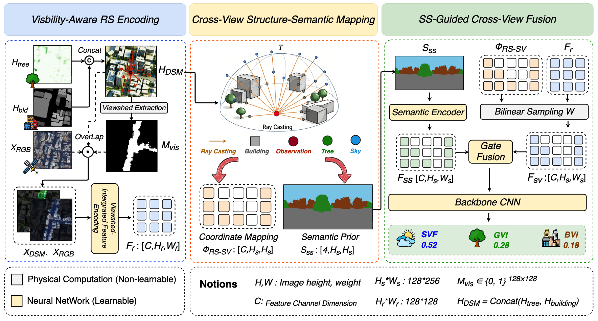

# SS-CVNet

SS-CVNet predicts street view indicators — **BVI** (Green View Index), **GVI** (Sky View Index), and **SVF** (Sky View Factor) — directly from satellite imagery. It establishes a geometric correspondence between the satellite view and the ground panorama via physics-based ray casting, and fuses RGB appearance with building/tree height information using depth-aware attention.

## Framework



## Quick Start

### 1. Prerequisite: generate the mask data

SS-CVNet requires pre-computed geometric masks (visibility mask, semantic mask, and mapping matrix). Generate them first with [generate/generate_masks.py](generate/generate_masks.py):

```bash
python generate/generate_masks.py \
    --config configs/SS-CVNet.yaml \
    --cities all cities
```

### 2. Train

```bash
python train.py --config configs/SS-CVNet.yaml

# or in the background
nohup python train.py --config configs/SS-CVNet.yaml > /dev/null 2>&1 &
```

Outputs (best model, per-epoch metrics) are written to `Parameter/<perspective>/<exp_name>/`.

Useful overrides:

```bash
# Train on specific cities only
python train.py --config configs/SS-CVNet.yaml --cities Adelaide San_Francisco

# Leave-One-City-Out validation
python train.py --config configs/SS-CVNet.yaml --set data.val_cities "['Tokyo']"
```

### 3. Inference

Batch prediction over all cities:

```bash
python generate/Cities_predicate_multi_view.py --config configs/SS-CVNet.yaml --perspective multi_view
```

## Project Structure

```
├── train.py                                # Training entry point
├── configs/
│   └── SS-CVNet.yaml                       # Training configuration (incl. ablation options)
├── models/                                 # Model definitions
│   ├── ss_cvnet.py                         # SS-CVNet full network + factory
│   ├── VIFE.py                            # Depth-aware window self-attention (VIFE)
│   ├── modules.py                          # Shared modules: alignment, backbone encoder, heads
│   ├── model.py                            # Multi-architecture model factory
│   ├── loss.py                             # Loss: weighted MSE + physics constraint
│   ├── cross_view_geometric.py             # Cross-view geometric correspondence
│   ├── ray_casting.py                      # Vectorized cross-view ray casting
│   ├── visibility.py                       # Ground visibility analyzer (Bresenham)
│   ├── voxel_grid.py                       # 3D voxel grid builder (CUDA)
│   ├── projection_transformer.py           # Equirectangular → fisheye/perspective projections
│   └── polar_transform_model.py            # Polar transformation baseline
├── utils/                                  # Data loader, logger, seed utilities
├── generate/
│   ├── generate_masks.py                   # Mask generation (prerequisite for training)
│   └── Cities_predicate_multi_view.py      # Batch multi-view inference
└── tools/                                  # Preprocessing and data integrity tests
```

## Ablation Options

Following Section 4.3 of the paper, the ablation study covers three groups of experiments. All switches live under `model.ablation` in [configs/SS-CVNet.yaml](configs/SS-CVNet.yaml).

### Group 1 — Visibility-aware encoding

The ray-cast gradient viewshed mask `M_vis` is replaced with three alternative visibility priors:

| Variant | Mechanism | Config | R² (BVI / GVI / SVF) |
|---|---|---|---|
| NP (Naive-Patch) | Full RS patch | `use_visibility_mask: false` | 0.862 / 0.763 / 0.826 |
| RC-50m (Radius-Constraint) | Fircular mask of 50 m radius | `use_center_circle_mask: true` | 0.861 / 0.765 / 0.826 |
| AM (Attention-Mask) | Learnable attention | `use_se_attention: true` | 0.828 / 0.704 / 0.787 |
| **SS-CVNet** | Ray-cast | `use_visibility_mask: true` (default) | **0.876 / 0.791 / 0.847** |

`M_vis` attains the best score on every metric. Proximity alone (RC-50m) cannot capture 3D occlusion, and the purely data-driven AM injects noise without geometric grounding.

### Group 2 — Cross-view mapping mechanism 

The ray-cast coordinate mapping field `Φ_RS-SV` is compared against four alternative alignment strategies:

| Variant | Mechanism | Config | R² (BVI / GVI / SVF) |
|---|---|---|---|
| DP (Direct-Pooling) | Global pooling | — | 0.807 / 0.723 / 0.817 |
| PF (Polar-Flat) | Polar transform | `use_polar_transform: true` | 0.866 / 0.782 / 0.833 |
| STN (Learnable-STN) | Spatial transformer | `use_learnable_matrix: true` | 0.849 / 0.733 / 0.815 |
| CA (Cross-Attention) | Soft cross-attention alignment | `fusion_strategy: cma` | 0.855 / 0.751 / 0.830 |
| **SS-CVNet** | Ray-cast mapping | default | **0.876 / 0.791 / 0.847** |

Explicit geometry outperforms data-driven alignment, which in turn outperforms geometry-free pooling — confirming that dense, physically grounded correspondences are essential for cross-view feature transfer. An additional code-only option, `use_cross_view_alignment: false`, bypasses the unified mapping in favor of dual-branch gated fusion.

### Group 3 — Feature fusion strategy (Module 3)

The fusion of the semantic features with the warped texture features inside the cross-view alignment module is compared across three schemes:

| Variant | Mechanism | Config | R² (BVI / GVI / SVF) |
|---|---|---|---|
| RSC (Raw-Semantic Concat) | Static concat | `fusion_strategy: rsc` | 0.852 / 0.762 / 0.821 |
| CMA (Cross-Modal Attention) | Soft attention | `fusion_strategy: cma` | 0.855 / 0.751 / 0.830 |
| SSI (Static Semantic-Infill) | Linear infill | `fusion_strategy: ssi` | 0.852 / 0.765 / 0.826 |
| **SS-CVNet (gate)** | Dynamic gating | `fusion_strategy: gate` (default) | 0.876 / 0.791 / 0.847 |

### Running an ablation

Variants marked with a config key can be trained directly via `--set` overrides:

```bash
# RC-50m: circular mask instead of the ray-cast visibility mask
python train.py --config configs/SS-CVNet.yaml \
    --set model.ablation.use_visibility_mask false \
    --set model.ablation.use_center_circle_mask true \
    --set model.ablation.circle_mask_radius 50 \
    --set exp_name sscvnet_rc50

# STN: learnable mapping matrix instead of the ray-cast mapping field
python train.py --config configs/SS-CVNet.yaml \
    --set model.ablation.use_learnable_matrix true \
    --set exp_name sscvnet_stn

# RSC / CMA / SSI fusion variants (Group 3)
python train.py --config configs/SS-CVNet.yaml \
    --set model.ablation.fusion_strategy rsc \
    --set exp_name sscvnet_rsc

python train.py --config configs/SS-CVNet.yaml \
    --set model.ablation.fusion_strategy cma \
    --set exp_name sscvnet_cma

python train.py --config configs/SS-CVNet.yaml \
    --set model.ablation.fusion_strategy ssi \
    --set exp_name sscvnet_ssi
```

More examples and a recommended ablation workflow can be found in the comments of [configs/SS-CVNet.yaml](configs/SS-CVNet.yaml).
